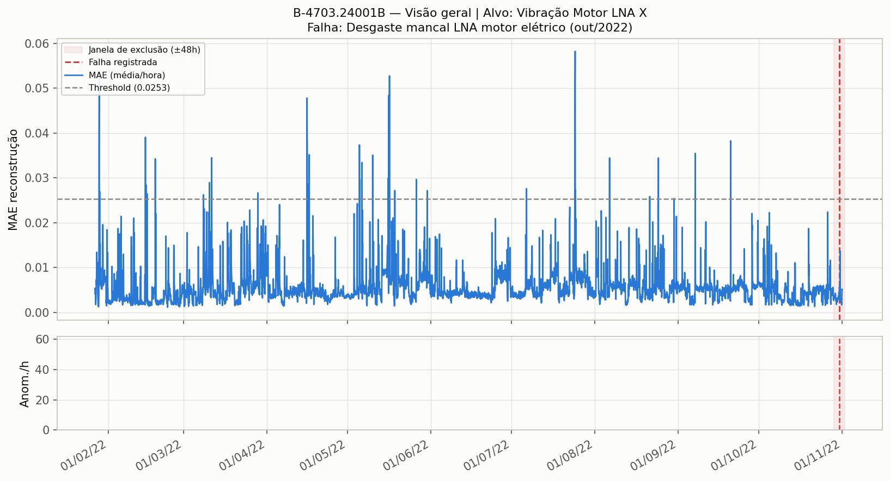
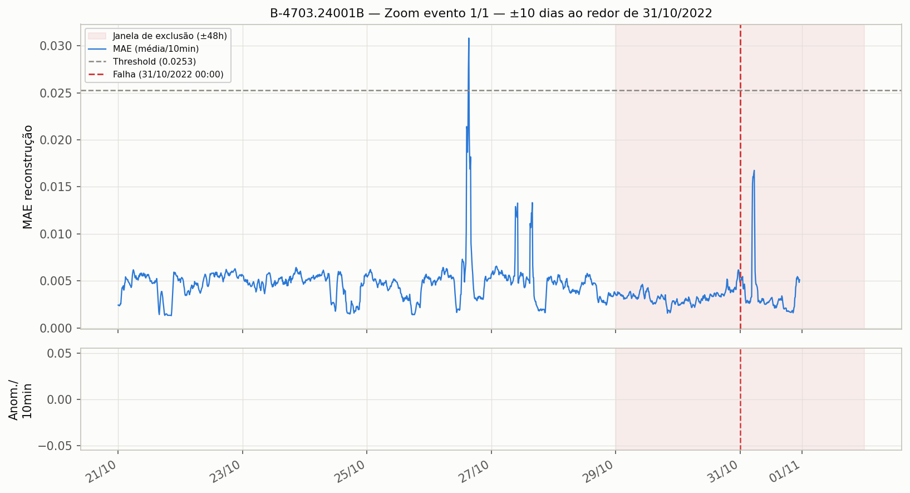

# Análise de falha — Equipamento B-4703.24001B

## Qual falha estamos tentando predizer

- **Equipamento:** B-4703.24001B
- **Falha(s) registrada(s):** *"Desgaste mancal LNA motor elétrico (out/2022)"*
- **Data(s) da(s) falha(s):** 2022-10-31
- **Task ClearML (produção, real):** `1b19ab0104f34759919648431e5d1629`
- **Nº de eventos de falha documentados:** 1

## Modelo configurado

- **Sensor-alvo (o que o autoencoder tenta reconstruir):** Vibração Motor LNA X
- **Sensores de entrada (contexto multivariado, além do alvo):** 3
  - Vibração Motor LNA Y
  - Vibração Motor LA Y
  - Temperatura Motor LNA

- **Total de sensores no grupo (entrada multivariada):** 4
- Além deste grupo multivariado, a pipeline roda automaticamente modelos **univariados** extras para qualquer outro sensor do feather que não esteja neste grupo (subproduto da execução, não é o foco desta análise).

## Hiperparâmetros / configuração de treino

| Parâmetro | Valor |
|---|---|
| Janela de sequência (`TIME_STEPS`) | 60 passos |
| Stride | 1 |
| Split treino/val | temporal, 90%/10% |
| Normalização | zscore (estatística só do treino) |
| Outliers | quantile (clip 0.001–0.999) |
| Janela de exclusão de alarme (treino/avaliação) | ±2880 min (48h) |
| Busca de hiperparâmetros (KerasTuner) | 10 trials × 15 épocas (patience 5) |
| Batch size | 512 |
| Modo de threshold | target_rate (taxa-alvo 1%) |
| Regra ponto-a-ponto | k_of_window (janela 60, mínimo 5) |
| Máscara operacional | ativada |

## Resultados

| Métrica | Valor |
|---|---|
| Threshold calibrado (MAE) | 0.0253 |
| Taxa de anomalia (pontos/dia) | 1.7 |
| Alarmes documentados | 1 |
| Alarmes com anomalia detectada na janela (±48h) | 0 / 1 (hit_rate = 0.00) |

> ⚠️ **O modelo NÃO detectou nenhuma anomalia dentro da janela de ±48h dos eventos de falha.** Isso não significa necessariamente que o modelo é ruim — pode indicar que a degradação não é visível nos sensores escolhidos, que o threshold calibrado (taxa-alvo 1%) ficou conservador demais para este equipamento, ou que a falha teve caráter mais abrupto/sem precursores mensuráveis nesses canais.

### Antecedência de detecção (lead time)

| Evento | Data da falha | Descrição | Primeiro ponto anômalo (10 dias antes) | Lead time |
|---|---|---|---|---|
| 1 | 2022-10-31 | Desgaste mancal LNA motor elétrico (out/2022) | — | — (nenhum ponto anômalo nos 10 dias anteriores) |

> **Atenção:** essa coluna mostra o *primeiro* ponto marcado como anômalo nos 10 dias antes da falha — não implica necessariamente um sinal sustentado, nem que caiu dentro da janela de avaliação (±48h). Ver os gráficos de zoom para a forma real do sinal (ramp-up sustentado vs. blip isolado).

## Gráficos

### Visão geral (todo o período de dados)

### Zoom ±10 dias ao redor da falha (2022-10-31)

## Observação sobre granularidade da data da falha

Quando a falha só tem precisão de **dia** (sem horário nos registros originais), a hora usada como âncora nos gráficos (00:00) é apenas convenção. Isso não compromete a janela de exclusão/avaliação, pois ±48h é bem mais larga que a incerteza de 24h do dia.

## Arquivos

- `01_visao_geral.png` — MAE horário no período completo, com threshold e janela(s) de exclusão.
- `02_zoom_falha*.png` — MAE (10 min) e contagem de anomalias/ponto, zoom ±10 dias ao redor de cada evento de falha.
