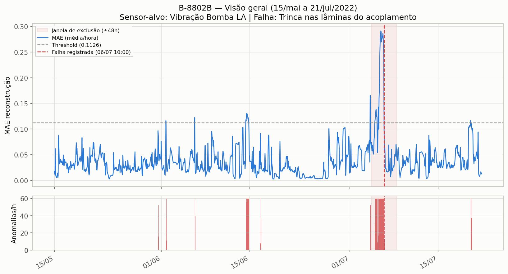
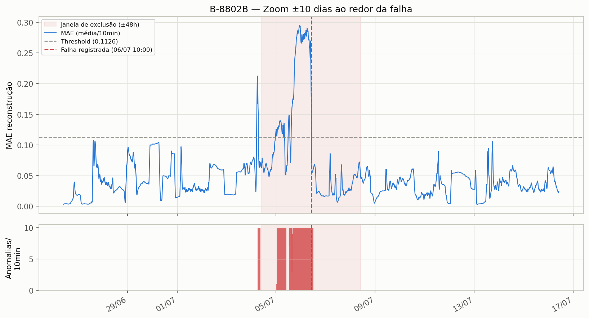

# Análise de falha — Equipamento B-8802B

## Qual falha estamos tentando predizer

- **Equipamento:** B-8802B (bomba)
- **Falha registrada:** *"Trinca nas lâminas do acoplamento"*
- **Data/hora da falha:** 2022-07-06 10:00 (granularidade diária no registro original; o horário "10:00" não deve ser lido como preciso — ver observação sobre a máscara de exclusão mais abaixo)
- **Sensor-alvo (o que o autoencoder tenta reconstruir):** Vibração Bomba LA
- **Grupo de sensores usado no treino (7 sensores):** Vibração Bomba LA, Pressão Descarga, Temperatura Bomba LA, Vibração Bomba LNA, Temperatura Motor LNA, Temperatura Motor LA, Temperatura Bomba LNA

## Metodologia (resumo)

Pipeline CNN-1D Autoencoder (`src/transpetro`, config `configs/transpetro/B-8802B_prod.json`):

1. Dados de 2022-05-15 a 2022-07-21 (feather `B-8802B.feather`, ~68 dias).
2. Janela de ±48h (2880 min) ao redor da falha é **excluída do treino** (não do score).
3. Normalização z-score (estatísticas só do período de treino), sequências de 60 passos.
4. Busca de hiperparâmetros: KerasTuner, 10 trials × 15 épocas, patience 5.
5. Score = MAE de reconstrução em **toda** a série (incluindo o período da falha).
6. Threshold calibrado por taxa-alvo de anomalia (`target_rate` = 1%) → **threshold = 0.1126**.
7. Regra ponto-a-ponto `k_of_window`: um ponto só é marcado como anômalo se ≥5 das 60 janelas de 60 passos ao seu redor excederem o threshold — isso filtra ruído isolado.

Execução real (não o smoke test): task ClearML `59c0cc4561ee4de0bb72120cb9446c19`.

## Resultados

| Métrica | Valor |
|---|---|
| Threshold calibrado (MAE) | 0.1126 |
| Alarmes documentados | 1 |
| Alarmes com anomalia detectada na janela ±48h | 1 (hit_rate = 1.0) |
| Taxa de anomalia (pontos/dia) | ~51,5 |

> **Atenção:** hit_rate = 100% é sobre uma amostra de **1 único evento de falha** — não é uma validação estatisticamente robusta, apenas confirma que o modelo reagiu no caso conhecido.

### Visão geral (15/mai a 21/jul/2022)

O MAE fica baixo e estável na maior parte do período. Existem **outros picos isolados acima do threshold** (ex.: ~01/06, ~08/06, ~15/06, ~17/07) que **não correspondem a nenhuma falha documentada** — provavelmente transientes operacionais (partidas/paradas) já que `ENABLE_OPERATIONAL_MASK` está desativado nesta config. Isso é um ponto de atenção: sem a máscara operacional, o modelo pode confundir transientes normais com anomalias.

### Zoom ±10 dias ao redor da falha

Aqui aparece o sinal relevante para a falha:

- As **anomalias de ponto** (após o filtro `k_of_window`, que exige repetição — não ruído isolado) começam a disparar de forma consistente em **2022-07-04**, intensificam-se em **07-05** e seguem até a falha em **07-06 10:00**. Depois disso, voltam a zero.
- Isso indica uma **antecedência (lead time) de ~1,5 a 2 dias** de sinal consistente antes da trinca no acoplamento.
- O MAE bruto de sequência (antes do filtro de ponto) já ultrapassa o threshold esporadicamente desde ~27/06, mas de forma isolada/ruidosa — é o filtro de ponto que separa sinal real de ruído.

## Observação sobre a granularidade da data da falha

A falha só é conhecida com precisão de **dia** (não de hora) nos registros originais; o "10:00" usado na config é um valor de conveniência. Isso **não compromete a análise**: a janela de exclusão/avaliação (±48h) é larga o suficiente (4x maior que a incerteza de 24h) para cobrir o dia inteiro da falha independentemente da hora usada como âncora. A única ressalva é cosmética — as linhas verticais nos gráficos marcam exatamente "10:00", o que pode sugerir precisão de hora que não existe de fato.

## Arquivos

- `01_visao_geral.png` — MAE horário no período completo, com threshold e janela de exclusão.
- `02_zoom_falha.png` — MAE (10 min) e contagem de anomalias/ponto, zoom ±10 dias ao redor da falha.
