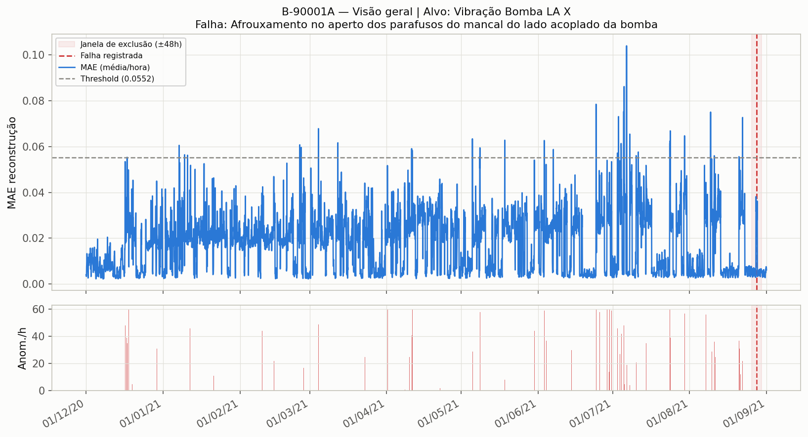
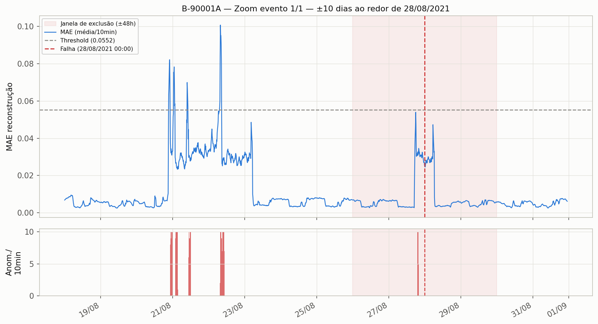

# Análise de falha — Equipamento B-90001A

## Qual falha estamos tentando predizer

- **Equipamento:** B-90001A
- **Falha(s) registrada(s):** *"Afrouxamento no aperto dos parafusos do mancal do lado acoplado da bomba"*
- **Data(s) da(s) falha(s):** 2021-08-28
- **Task ClearML (produção, real):** `b64ce118703f4a2daa3d6076906b9cb1`
- **Nº de eventos de falha documentados:** 1

## Modelo configurado

- **Sensor-alvo (o que o autoencoder tenta reconstruir):** Vibração Bomba LA X
- **Sensores de entrada (contexto multivariado, além do alvo):** 8
  - Vibração Bomba LA Y
  - Vibração Motor LA X
  - Vibração Motor LNA Y
  - Vibração Motor LA Y
  - Vibração Bomba LNA Y
  - Pressão Descarga
  - Vibração Bomba LNA X
  - Pressão Sucção

- **Total de sensores no grupo (entrada multivariada):** 9
- Além deste grupo multivariado, a pipeline roda automaticamente modelos **univariados** extras para qualquer outro sensor do feather que não esteja neste grupo (subproduto da execução, não é o foco desta análise).

## Hiperparâmetros / configuração de treino

| Parâmetro | Valor |
|---|---|
| Janela de sequência (`TIME_STEPS`) | 60 passos |
| Stride | 1 |
| Split treino/val | temporal, 90%/10% |
| Normalização | zscore (estatística só do treino) |
| Outliers | quantile (clip 0.001–0.999) |
| Janela de exclusão de alarme (treino/avaliação) | ±2880 min (48h) |
| Busca de hiperparâmetros (KerasTuner) | 10 trials × 15 épocas (patience 5) |
| Batch size | 512 |
| Modo de threshold | target_rate (taxa-alvo 1%) |
| Regra ponto-a-ponto | k_of_window (janela 60, mínimo 5) |
| Máscara operacional | ativada |

## Resultados

| Métrica | Valor |
|---|---|
| Threshold calibrado (MAE) | 0.0552 |
| Taxa de anomalia (pontos/dia) | 31.4 |
| Alarmes documentados | 1 |
| Alarmes com anomalia detectada na janela (±48h) | 1 / 1 (hit_rate = 1.00) |

> ✅ **O modelo detectou anomalia dentro da janela de todos os eventos de falha documentados.**

### Antecedência de detecção (lead time)

| Evento | Data da falha | Descrição | Primeiro ponto anômalo (10 dias antes) | Lead time |
|---|---|---|---|---|
| 1 | 2021-08-28 | Afrouxamento no aperto dos parafusos do mancal do lado acoplado da bomba | 2021-08-20 22:21:00 | 169.7h (~7.1 dias) antes |

> **Atenção:** essa coluna mostra o *primeiro* ponto marcado como anômalo nos 10 dias antes da falha — não implica necessariamente um sinal sustentado, nem que caiu dentro da janela de avaliação (±48h). Ver os gráficos de zoom para a forma real do sinal (ramp-up sustentado vs. blip isolado).

## Gráficos

### Visão geral (todo o período de dados)

### Zoom ±10 dias ao redor da falha (2021-08-28)

## Observação sobre granularidade da data da falha

Quando a falha só tem precisão de **dia** (sem horário nos registros originais), a hora usada como âncora nos gráficos (00:00) é apenas convenção. Isso não compromete a janela de exclusão/avaliação, pois ±48h é bem mais larga que a incerteza de 24h do dia.

## Arquivos

- `01_visao_geral.png` — MAE horário no período completo, com threshold e janela(s) de exclusão.
- `02_zoom_falha*.png` — MAE (10 min) e contagem de anomalias/ponto, zoom ±10 dias ao redor de cada evento de falha.
