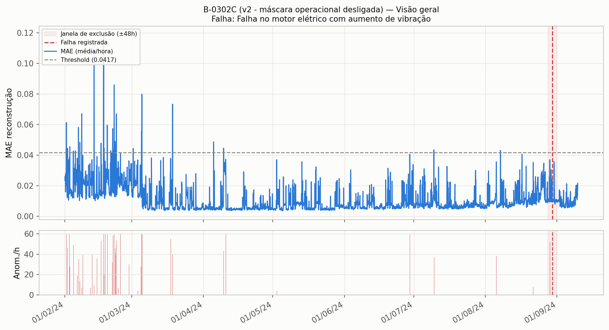
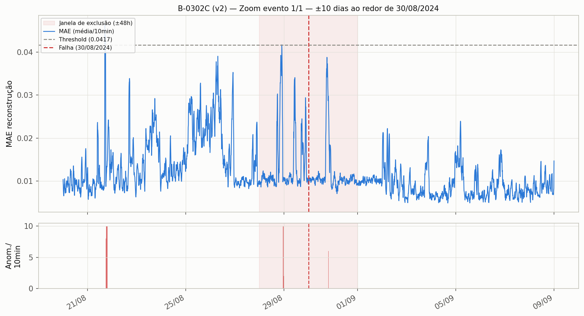

# B-0302C — resultado após correção (v2)

## Falha e sensores

- **Falha:** "Falha no motor elétrico com aumento de vibração" — 2024-08-30
- **Sensor-alvo:** Vibração Mancal Bomba LA
- **Sensores de entrada (grupo):** Posição UV03201C, Corrente Media Motor, Corrente no Motor, Pressão diferencial filtro, Potência Reativa

## Mudança aplicada (v1 → v2)

Causa-raiz diagnosticada em `../../modelos_nao_detectados/README.md`: a máscara de estado operacional suprimia **100% da janela de ±48h antes da falha** (equipamento inteiro classificado como "off_longo"). Correção: `ENABLE_OPERATIONAL_MASK: true → false`.

## Resultado

| | v1 (com máscara) | v2 (sem máscara) |
|---|---|---|
| Threshold | 0,0514 | 0,0417 |
| Hit rate (±48h) | **0,0** (0/1) | **1,0** (1/1) ✅ |
| Anomalias/dia | — | 31,3 |

## Antecedência de detecção (lead time)

- **Primeiro ponto anômalo dentro da janela de avaliação (±48h antes da falha): 2024-08-28 22:54 → 25,1h de antecedência.**
- Olhando mais para trás (10 dias antes), já havia um ponto isolado em 2024-08-21 (198h/8,25 dias antes) — mas é um blip isolado, não um sinal sustentado; a antecedência "real" e sustentada começa nas ~25h finais antes da falha (ver gráfico de zoom).

## Falsos positivos

Ao longo dos 222 dias de dados: **65 episódios distintos** de anomalia fora da janela da falha, totalizando 2,19% do tempo. É um volume alto — bem mais ruidoso que os modelos "limpos" do lote anterior (ex.: B-4064A tinha só 2 episódios em 124 dias). A remoção da máscara operacional resolveu a detecção, mas trouxe de volta ruído que a máscara também suprimia — trade-off a considerar antes de usar isso como alarme operacional direto.

## Gráficos

### Visão geral

### Zoom ±10 dias ao redor da falha (30/08/2024)

O gráfico mostra picos de MAE recorrentes ao longo de todo o período (muitos abaixo ou perto do threshold), com dois picos claramente acima do threshold dentro da janela de exclusão (28-29/08), poucas horas/1 dia antes da falha.
