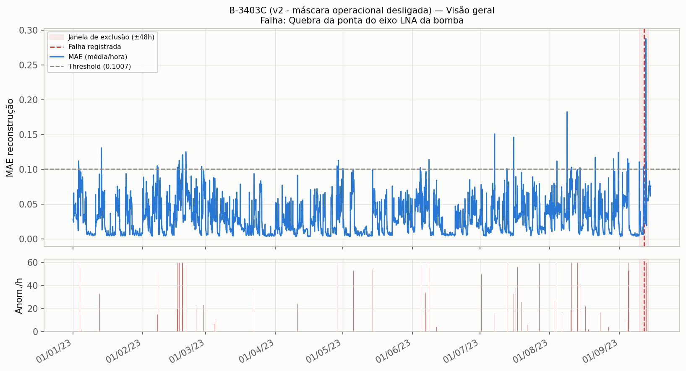
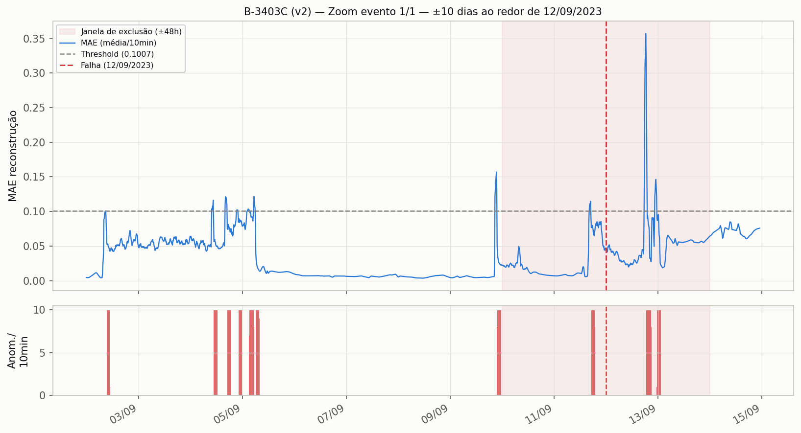

# B-3403C — resultado após correção (v2)

## Falha e sensores

- **Falha:** "Quebra da ponta do eixo LNA da bomba" — 2023-09-12
- **Sensor-alvo:** Vibração
- **Sensores de entrada (grupo):** Temperatura Enrolamento, Corrente, Temperatura Mancal Motor LNA, Press Desc, Temperatura Mancal Bomba LNA Axial, Temperatura Mancal Bomba LA, Temperatura Mancal Motor LA, Press Suc, Pressão Lubrificação, Temperatura Mancal Bomba LNA Radial

## Mudança aplicada (v1 → v2)

Causa-raiz diagnosticada: máscara operacional suprimindo (só 11,1% do tempo em "on" nas 48h antes da falha) **+** correlação estatística péssima entre o alvo e os sensores de entrada (`|r|` máximo de apenas 0,18 — o pior conjunto de correlação dos 12 equipamentos). Correção aplicada: `ENABLE_OPERATIONAL_MASK: true → false`. A correlação fraca **não foi corrigida** (não há sensor alternativo disponível no feather), mas o resultado mostra que a máscara era, na prática, a causa dominante.

## Resultado

| | v1 (com máscara) | v2 (sem máscara) |
|---|---|---|
| Threshold | 0,1000 | 0,1007 |
| Hit rate (±48h) | **0,0** (0/1) | **1,0** (1/1) ✅ |
| Anomalias/dia | — | 35,0 |

## Antecedência de detecção (lead time)

- **Primeiro ponto anômalo dentro da janela de avaliação (±48h antes da falha): 2023-09-11 17:18 → apenas 6,7h de antecedência.**
- Nos 10 dias anteriores já havia sinal esporádico (primeiro ponto em 2023-09-02, ~230h/9,6 dias antes), mas isolado — o sinal só fica consistente e sustentado nas ~7h finais antes da falha (ver zoom).
- É a menor antecedência sustentada dos 3 casos corrigidos — coerente com a correlação fraca: mesmo destravando a máscara, o modelo não tem uma estrutura multivariada forte para antecipar a degradação com muita folga.

## Falsos positivos

Ao longo de 257 dias de dados: **84 episódios distintos** de anomalia fora da janela da falha (2,37% do tempo) — o maior número de falsos positivos dos 3 casos corrigidos, consistente com o diagnóstico de correlação fraca (o autoencoder reage a ruído idiossincrático dos sensores, não a uma estrutura conjunta real).

## Gráficos

### Visão geral

### Zoom ±10 dias ao redor da falha (12/09/2023)

O zoom mostra vários picos de MAE ao longo dos 10 dias anteriores (inclusive picos maiores que o da própria falha, como o de 03/09 e o pico de ~0,36 logo após a falha em 13/09) — reforça que este é o modelo mais ruidoso dos 3, mesmo tendo "acertado" a janela de avaliação.
