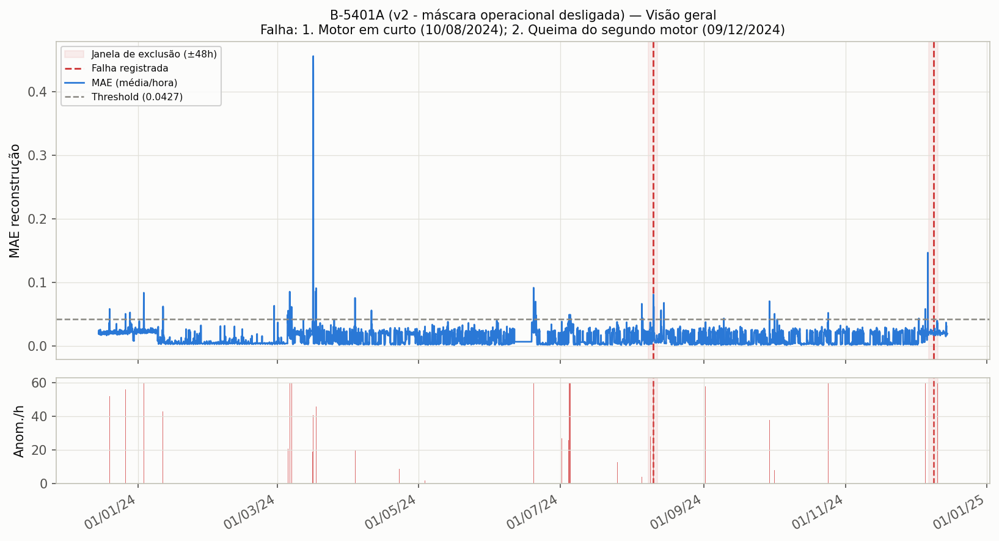
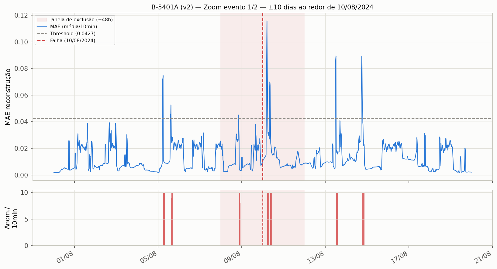
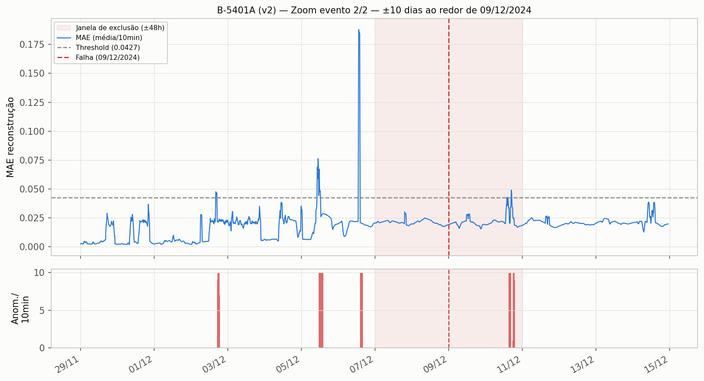

# B-5401A — resultado após correção (v2)

## Falha e sensores

- **Falhas (2 eventos):** 1) "Motor em curto" — 2024-08-10; 2) "Queima do segundo motor" — 2024-12-09
- **Sensor-alvo:** Corrente
- **Sensores de entrada (grupo):** Indicador de Velocidade, Pressão de Descarga, Temperatura Mancal Bomba LNA, Temperatura Mancal Bomba LA, Temperatura Mancal Motor LA, Pressão de Sucção

## Mudança aplicada (v1 → v2)

Este era o caso com **duas causas-raiz simultâneas**:
1. Contaminação por outlier extremo no sensor "Corrente" (valores de leitura chegando a ~2,3×10¹⁴, provavelmente falha de instrumentação/SCADA), que corrompia o clip de outlier por quantil e colapsava o threshold de calibração para um valor degenerado (~0,000115, coincidindo com os quartis 25-50-75% — métrica sem poder discriminativo).
2. Máscara operacional suprimindo o evento 2 (0,0% de tempo em "on" nas 48h antes da falha de dezembro/2024).

Correções aplicadas: `OUTLIER_MODE: quantile → mad` (mediana é robusta à contaminação) **+** `ENABLE_OPERATIONAL_MASK: true → false`.

**Nota técnica:** esta task teve que ser reenfileirada uma vez — a primeira execução completou o treino mas todos os artefatos vieram inacessíveis (404) no ClearML, por um bug de infraestrutura do lado do cliente (`events.add_batch request exceeds limit`, 715 ocorrências no log, aparentemente corrompendo a sessão HTTP até o upload final). O resultado abaixo é da segunda execução, bem-sucedida.

## Resultado

| | v1 | v2 |
|---|---|---|
| Threshold | 0,000115 (degenerado) | 0,0427 |
| Hit rate (±48h) | **0,0** (0/2) | **1,0** (2/2, com ressalva — ver abaixo) |
| Anomalias/dia | ~1,2 | 25,0 |

## Antecedência de detecção (lead time) — **leitura crítica por evento**

| Evento | Data | Primeiro ponto anômalo na janela (±48h antes) | Lead time |
|---|---|---|---|
| 1 — Motor em curto | 2024-08-10 | 2024-08-08 21:17 | **26,7h de antecedência real** ✅ |
| 2 — Queima do 2º motor | 2024-12-09 | *nenhum ponto antes da falha* | **sem antecedência** ⚠️ |

**O evento 2 não teve nenhuma detecção antes da falha.** O "hit" contado pelo `hit_rate` (que avalia ±48h, incluindo depois da falha) veio de anomalias detectadas em **2024-12-10, entre 15h e 19h — ou seja, 15 a 19 horas DEPOIS da queima do motor**, não antes. Isso é uma confirmação pós-falha (o comportamento anômalo do sensor após o motor queimar), não uma predição. Contar isso como "sucesso de detecção" seria enganoso — é importante distinguir os dois eventos: o evento 1 é uma vitória real de antecipação; o evento 2 não é.

## Falsos positivos

Ao longo de 366 dias de dados: **65 episódios distintos** de anomalia fora das janelas de falha (1,68% do tempo) — nível intermediário entre os 3 casos corrigidos.

## Gráficos

### Visão geral

### Zoom evento 1 — ±10 dias ao redor de 10/08/2024

### Zoom evento 2 — ±10 dias ao redor de 09/12/2024

No zoom do evento 2, repare que o pico de MAE mais alto (~0,116) ocorre **depois** da linha vermelha (a falha), não antes — visualmente confirma a leitura crítica acima.
